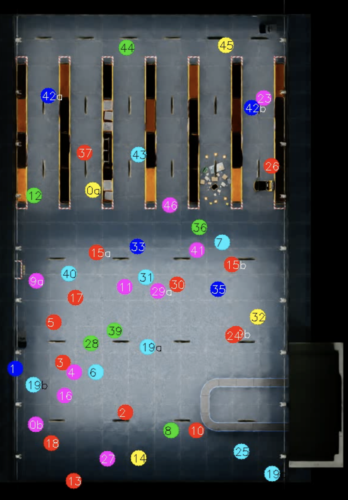
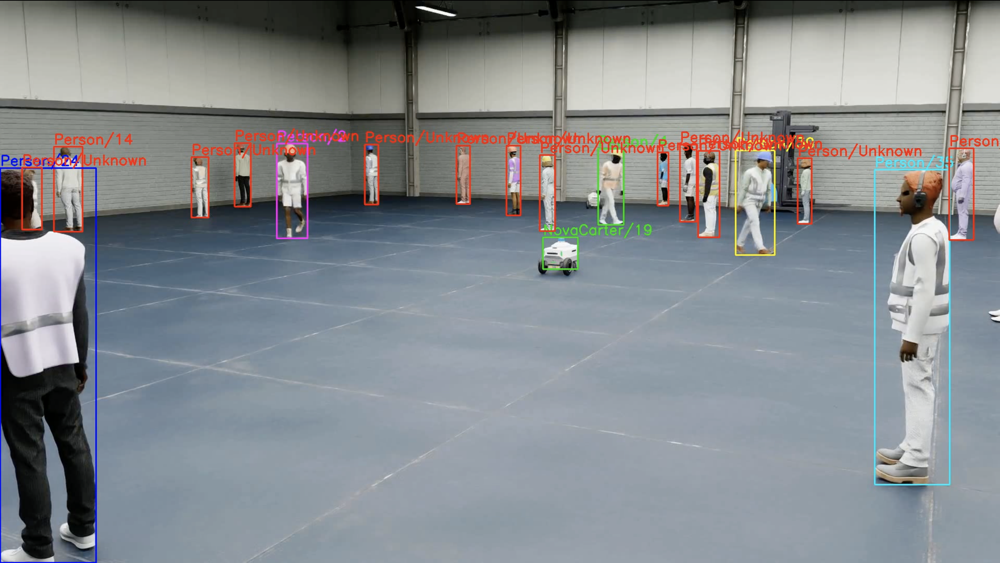

# Multi-Camera Person Re-Identification and Mapping

## 🔹 Project Overview
This project focuses on **multi-camera analysis** using:
- **Detection** (object bounding boxes + confidence filtering)  
- **Re-Identification (ReID)** with feature embeddings  
- **Mapping** from image coordinates to real-world plane via depth and calibration  

The system produces a **bird’s-eye view plan** alongside video feeds, enabling consistent identity assignment and world-coordinate tracking.

---

## 🔹 Pipeline

1. - **Detection**: [YOLOv11](https://github.com/ultralytics/ultralytics) (fine-tuned on PhysicalAI-SmartSpaces/MTMC_Tracking_2025 dataset).
   - Real-time object detection with bounding boxes and confidence scores.  

2. - **Re-Identification (ReID)**: [TransReID-SSL](https://github.com/damo-cv/TransReID-SSL), fine-tuned on the PhysicalAI-SmartSpaces/MTMC_Tracking_2025/train/Warehouse_000 dataset.
   - Extracts embeddings for appearance matching.  
   - Uses **DBSCAN** to split duplicate IDs.  

3. **Mapping**  
   - Projects 2D bounding box points to 3D world coordinates using depth maps.  
   - Normalizes to 2D floor plan for visualization.  
   - Applies smoothing and median filtering to reduce jitter.  

---

## 🔹 Results

| Task       | Metric              | Score |
|------------|---------------------|-------|
| Detection  | mAP@50              | **0.934** |
| Detection  | mAP50-95            | **0.816** |
| ReID       | Rank-1 Accuracy     | **1.0** |
| ReID       | Rank-5 Accuracy     | **1.0%** |
| ReID       | Rank-10 Accuracy    | **1.0%** |
| ReID       | mAP                 | **0.982%** |


---

## 🔹 Demo Videos

Below are qualitative results.  
Each row shows multiple camera views, with the **center video being the global floor plan** (bird’s-eye view).

<table>
   
  <tr>
    <td></td>
    <td></td>
    <td></td>
    <td rowspan="3"></td>
  </tr>
  
  <tr>
    <td></td>
    <td></td>
    <td></td>
  </tr>
  
  <tr>
    <td></td>
    <td></td>
    <td></td>
  </tr>
  
</table>


---

## 🔹 Dataset
This project uses the [PhysicalAI-SmartSpaces dataset](https://huggingface.co/datasets/nvidia/PhysicalAI-SmartSpaces), part of the [AI City Challenge](https://www.aicitychallenge.org/).

### References
- TransReID-SSL:
```bibtex
@article{luo2021self,
  title={Self-Supervised Pre-Training for Transformer-Based Person Re-Identification},
  author={Luo, Hao and Wang, Pichao and Xu, Yi and Ding, Feng and Zhou, Yanxin and Wang, Fan and Li, Hao and Jin, Rong},
  journal={arXiv preprint arXiv:2111.12084},
  year={2021}
}
```
---

Please cite the following when using this dataset:

```bibtex
@InProceedings{Tang25AICity25,
  author = {Zheng Tang and Shuo Wang and David C. Anastasiu and Ming-Ching Chang and Anuj Sharma and Quan Kong and Norimasa Kobori and Munkhjargal Gochoo and Ganzorig Batnasan and Munkh-Erdene Otgonbold and Fady Alnajjar and Jun-Wei Hsieh and Tomasz Kornuta and Xiaolong Li and Yilin Zhao and Han Zhang and Subhashree Radhakrishnan and Arihant Jain and Ratnesh Kumar and Vidya N. Murali and Yuxing Wang and Sameer Satish Pusegaonkar and Yizhou Wang and Sujit Biswas and Xunlei Wu and Zhedong Zheng and Pranamesh Chakraborty and Rama Chellappa},
  title = {The 9th {AI} {C}ity {C}hallenge},
  booktitle = {Proc. ICCV Workshops},
  address = {Honolulu, HA, USA},
  year = {2025}
}

@inproceedings{Wang24AICity24,
  author = {Shuo Wang and David C. Anastasiu and Zheng Tang and Ming-Ching Chang and Yue Yao and Liang Zheng and Mohammed Shaiqur Rahman and Meenakshi S. Arya and Anuj Sharma and Pranamesh Chakraborty and Sanjita Prajapati and Quan Kong and Norimasa Kobori and Munkhjargal Gochoo and Munkh-Erdene Otgonbold and Ganzorig Batnasan and Fady Alnajjar and Ping-Yang Chen and Jun-Wei Hsieh and Xunlei Wu and Sameer Satish Pusegaonkar and Yizhou Wang and Sujit Biswas and Rama Chellappa},
  title = {The 8th {AI} {C}ity {C}hallenge},
  booktitle = {Proc. CVPR Workshops},
  pages = {7261--7272},
  address = {Seattle, WA, USA},
  year = {2024}
}

@misc{Wang24BEVSUSHI,
  author = {Yizhou Wang and Tim Meinhardt and Orcun Cetintas and Cheng-Yen Yang and Sameer Satish Pusegaonkar and Benjamin Missaoui and Sujit Biswas and Zheng Tang and Laura Leal-Taix{\'e}},
  title = {{BEV-SUSHI}: {M}ulti-target multi-camera {3D} detection and tracking in bird's-eye view},
  note = {arXiv:2412.00692},
  year = {2024}
}
